# Nomad Path Tracer

Research-oriented Metal path tracer for macOS, with a strong focus on dynamic geometry residency, GPU memory budgeting, benchmark automation, and data generation for learned residency policies.

## Project Metadata

| Field | Value |
| --- | --- |
| Project name | `Nomad Path Tracer` |
| Repository type | Renderer + benchmarking + research tooling |
| Primary languages | C++, Metal Shading Language, Python |
| Target platform | macOS with Metal support |
| Build system | Xcode project (`Nomad Path Tracer.xcodeproj`) |
| Main target | `Nomad Path Tracer` |
| Research focus | Geometry residency strategies, memory-aware rendering, perceptual-quality-driven policy learning |
| Current status | Active research prototype |
| Optional external tools | FFmpeg, Intel Open Image Denoise, Intel Labs CGVQM |
| License | No license file is currently included in this repository |

## Overview

This repository combines three tightly connected pieces of work:

1. A Metal path tracer for macOS.
2. A residency-management research platform with multiple runtime strategies.
3. A benchmarking and data-generation pipeline for learned residency policies such as `UnifiedNeural`.

The renderer is designed for controlled experiments on how scene geometry should remain resident, stream in, or be deprioritized under memory pressure. Alongside the runtime, the repository includes tooling for:

- repeatable scene sweeps,
- EXR capture and deferred denoising,
- timing and memory analysis,
- object ablation studies,
- CGVQM-based label generation,
- and lightweight learned-policy training/export workflows.

## Highlights

- Metal-based path tracer with scene-driven configuration.
- Multiple geometry residency strategies in one renderer.
- Unified GPU memory budget experiments with detailed benchmark logging.
- Automated Bistro sweeps across strategy variants.
- EXR capture, deferred OIDN denoising, and FFmpeg video assembly.
- Object-level feature logging for neural residency research.
- CGVQM label generation using strict `AlwaysResident` baselines plus one-object-off ablations.
- Modular renderer layout separating residency, neural logic, frame capture, textures, and core rendering flow.

## Residency Strategies

The renderer currently includes the following residency strategy families:

- `Always resident`
- `Distance-based LOD`
- `Ray-hit budget`
- `Screen-space footprint`
- `Energy importance`
- `Probabilistic`
- `Unified score`
- `Predictive environment`
- `Environment hit`
- `Unified neural`

The Bistro study scene variants under `/Users/apollo/Downloads/MetalPathtracer-dev_alt_4/Nomad Path Tracer` encode these strategies and their conservative/aggressive variants for sweep-based comparison.

## Repository Layout

```text
.
├── README.md
├── Nomad Path Tracer.xcodeproj
├── Nomad Path Tracer/
│   ├── Renderer/
│   │   ├── Renderer.cpp
│   │   ├── RendererResidency.cpp
│   │   ├── RendererUnifiedNeural.cpp
│   │   ├── RendererFrameCapture.cpp
│   │   ├── RendererTextures.cpp
│   │   └── README.md
│   ├── Scene/
│   │   ├── Scene.cpp
│   │   ├── SceneBVH.cpp
│   │   ├── SceneLoader.cpp
│   │   ├── MaterialUtils.cpp
│   │   ├── MaterialUtils.h
│   │   └── README.md
│   ├── Window/
│   ├── scene.xml
│   ├── scene_bistro_test_v2*.xml
│   ├── README.md
│   └── StudyNotes.md
├── Benchmarks/
│   ├── README.md
│   ├── run_bistro_sweep.py
│   ├── run_neural_cgvqm_pipeline.py
│   ├── run_neural_ablation_batch.py
│   ├── run_neural_cgvqm_labels.py
│   ├── train_unified_neural_model.py
│   ├── export_unified_neural_model.py
│   └── analysis helpers
└── tests/
```

## Renderer Module Structure

The renderer has been split into focused translation units so residency experimentation can evolve without turning `Renderer.cpp` back into a monolith.

- `Renderer.cpp`
  - core renderer lifecycle, scene setup, frame loop, acceleration-structure orchestration, metrics, and shared runtime plumbing
- `RendererResidency.cpp`
  - runtime residency strategies and per-frame object activation/deactivation decisions
- `RendererUnifiedNeural.cpp`
  - neural model loading, feature-vector construction, teacher/residual helpers, and runtime prediction logic
- `RendererFrameCapture.cpp`
  - EXR capture, deferred denoise helpers, and frame-output processing
- `RendererTextures.cpp`
  - texture-slot lifecycle, texture residency, material textures, and environment texture management

For scene-side details, see:

- `/Users/apollo/Downloads/MetalPathtracer-dev_alt_4/Nomad Path Tracer/Renderer/README.md`
- `/Users/apollo/Downloads/MetalPathtracer-dev_alt_4/Nomad Path Tracer/Scene/README.md`

## Requirements

### Core renderer

- macOS with Metal support
- Xcode with command-line tools
- Apple Clang / Xcode toolchain

### Benchmarking and analysis

- Python 3.10+
- `ffmpeg` for EXR-to-video conversion
- Intel Open Image Denoise (`oidnDenoise`) for deferred denoising

### Optional perceptual labeling workflow

- A working local checkout of [IntelLabs/cgvqm](https://github.com/IntelLabs/cgvqm)
- A Python environment that can run `run_metric.py`

Note: the repository intentionally ignores local benchmark outputs and CGVQM virtual environments in `.gitignore`.

## Building

List the available project settings:

```bash
xcodebuild -list -project "Nomad Path Tracer.xcodeproj"
```

Build the release target into the repository-local `build/` directory:

```bash
xcodebuild \
  -project "Nomad Path Tracer.xcodeproj" \
  -scheme "Nomad Path Tracer" \
  -configuration Release \
  -derivedDataPath build
```

Expected executable path after a successful build:

```text
build/Build/Products/Release/Nomad Path Tracer.app/Contents/MacOS/Nomad Path Tracer
```

The Metal runtime library `default.metallib` must remain beside the executable. The benchmark tooling checks for this preflight condition before launching sweeps.

## Running

The renderer is driven by scene XML files. A common study entry point is:

- `/Users/apollo/Downloads/MetalPathtracer-dev_alt_4/Nomad Path Tracer/scene_bistro_test_v2.xml`

Most automated runs in this repository use the benchmark scripts rather than manual app launch, because those scripts also set output paths, frame limits, capture options, and resumable run folders.

## Runtime Controls

Important runtime environment variables:

- `MPT_RUNS_PATH`
  - Directory where run artifacts are written.
- `MPT_MAX_FRAMES`
  - Stop after a fixed number of frames for keyframed scenes.
- `MPT_CAPTURE_EXR`
  - Enable EXR capture.
- `MPT_CAPTURE_INTERVAL`
  - Capture every `n` frames.
- `MPT_FORCE_OBJECT_OFF`
  - Force a specific object off; used by ablation tooling.
- `MPT_MAX_TILE_WORK`
  - Cap tile work per command buffer to reduce watchdog-triggered GPU aborts.
- `MPT_MAX_TILES_PER_COMMAND`
  - Additional command buffer batching guardrail.
- `MPT_ALWAYS_RESIDENT_TILE_WORK_HALF`
  - Optional tighter budget for `AlwaysResident`.
- `MPT_HEAP_SHRINK`
  - Opt-in heap shrinking under sustained low utilization.

For more implementation-specific details, see:

- `/Users/apollo/Downloads/MetalPathtracer-dev_alt_4/Nomad Path Tracer/README.md`
- `/Users/apollo/Downloads/MetalPathtracer-dev_alt_4/Benchmarks/README.md`
- `/Users/apollo/Downloads/MetalPathtracer-dev_alt_4/Nomad Path Tracer/StudyNotes.md`

## Benchmarking Workflow

The main sweep driver is:

- `/Users/apollo/Downloads/MetalPathtracer-dev_alt_4/Benchmarks/run_bistro_sweep.py`

Example:

```bash
python3 Benchmarks/run_bistro_sweep.py \
  --app "build/Build/Products/Release/Nomad Path Tracer.app/Contents/MacOS/Nomad Path Tracer" \
  --output-root "Benchmarks/bistro_sweep_runs" \
  --max-frames 500
```

Useful options include:

- `--capture-exr`
- `--capture-interval`
- `--defer-oidn`
- `--log-neural-features`
- `--neural-clip-length`
- `--decision-observer`
- `--thermal-log`

The sweep tooling is resumable and writes per-run folders with:

- `run_summary.json`
- metrics CSVs
- performance logs
- GPU memory logs
- optional EXR frames

## Neural Residency Data Pipeline

This repository contains a full research pipeline for generating training data for learned residency policies.

### Goal

Learn an object-level predictor of visual importance:

- input: per-object clip features
- target: perceptual quality drop when that object is forcibly removed from residency

### Why the baseline is `AlwaysResident`

The label pipeline uses a strict `AlwaysResident` reference rather than an existing heuristic strategy. This avoids training the model to imitate heuristic mistakes and instead asks:

> How much does image quality change if this one object is removed?

### High-level pipeline

```mermaid
flowchart LR
    A["AlwaysResident feature run"] --> B["Clip-level object features"]
    B --> C["Ablation manifest selection"]
    C --> D["One-object-off ablation runs"]
    D --> E["EXR capture"]
    E --> F["Deferred denoise"]
    F --> G["Video encoding"]
    G --> H["CGVQM scoring"]
    H --> I["Training labels CSV"]
```



### Main scripts

- `Benchmarks/run_neural_cgvqm_pipeline.py`
  - one-command orchestration for feature logging plus ablation prep
- `Benchmarks/generate_neural_ablation_manifest.py`
  - selects a manageable per-clip object subset
- `Benchmarks/run_neural_ablation_batch.py`
  - executes object-off ablation jobs
- `Benchmarks/denoise_exr_batch.py`
  - backfills deferred denoising
- `Benchmarks/run_neural_cgvqm_labels.py`
  - assembles videos, runs CGVQM, and writes training labels
- `Benchmarks/train_unified_neural_model.py`
  - trains simple exported models such as linear baselines and small MLPs
- `Benchmarks/export_unified_neural_model.py`
  - writes compact runtime-consumable model files

### Object features collected

The clip-level neural feature logging currently captures object-oriented features such as:

- `primitive_count`
- `visible_frame_fraction`
- `mean_visible_coverage`
- `max_visible_coverage`
- `mean_distance`
- `min_distance`
- `mean_hit_probability`
- `mean_object_rayhit_score`
- `total_object_hits`
- `total_object_rays_tested`
- `toggle_count`
- `active_frame_fraction`
- `resident_frame_fraction`
- `streaming_frame_fraction`
- `transport_critical_frame_fraction`
- `mean_object_importance`
- `mean_estimated_object_bytes`
- `emissive_importance`
- `selection_score`

These features are intended to describe the ablated object over a clip, not just the scene globally.

### Training label

The neural target is derived from CGVQM:

- baseline: `AlwaysResident`
- ablation: `AlwaysResident + object off`
- label: `delta_cgvqm`

Interpretation:

- larger `delta_cgvqm` means the object is more visually important
- smaller `delta_cgvqm` means the object is safer to demote or offload

### Current learned-policy direction

The repository now supports several research directions for `UnifiedNeural`, including:

- direct CGVQM-supervised object importance prediction
- teacher-student variants where a heuristic such as ray-hit provides a dense teacher signal
- residual variants where the model learns a correction over a hand-designed teacher score
- exported tiny models suitable for runtime inference in the renderer

At the moment, the strongest results should still be treated as scene-specific and path-specific proof-of-concept experiments rather than broadly general policies.

## Benchmark Metrics

The repository logs standard timing and residency information, plus newer metrics that help separate:

- strict residency,
- transitional residency,
- visible scene complexity,
- and actual ray-tracing workload.

Examples include:

- `objects_onload_requested`
- `objects_offload_requested`
- `blas_build_requests`
- `primitive_rays_tested_last_frame`
- `primitive_hits_last_frame`
- `resident_geometry_memory_mb`
- `strict_resident_geometry_memory_mb`
- `resident_texture_memory_mb`
- `residency_memory_mb`
- `total_memory_cap_mb`
- `minimum_resident_footprint_mb`
- `total_memory_cap_relaxed_mb`

These metrics support both runtime debugging and later analysis of CPU/GPU timing and memory behavior.

## Research Positioning

This codebase is best understood as a renderer plus an experimentation framework.

It is particularly useful for:

- residency-strategy comparisons,
- GPU memory budget studies,
- object-ablation quality analysis,
- and prototype learned-policy research.

The current neural dataset workflow is most rigorous as a scene-specific and path-specific proof of concept. Expanding to multiple camera paths and multiple scenes is the natural next step toward stronger generalization.

## Related Documentation

- `/Users/apollo/Downloads/MetalPathtracer-dev_alt_4/Nomad Path Tracer/README.md`
  - runtime controls and GPU watchdog guardrails
- `/Users/apollo/Downloads/MetalPathtracer-dev_alt_4/Nomad Path Tracer/StudyNotes.md`
  - total memory cap and eviction-stall study notes
- `/Users/apollo/Downloads/MetalPathtracer-dev_alt_4/Benchmarks/README.md`
  - benchmark environment variables and CSV metric notes
- `/Users/apollo/Downloads/MetalPathtracer-dev_alt_4/Nomad Path Tracer/Renderer/README.md`
  - renderer module boundaries
- `/Users/apollo/Downloads/MetalPathtracer-dev_alt_4/Nomad Path Tracer/Scene/README.md`
  - scene/module boundaries

## Limitations

- macOS / Metal focused rather than cross-platform
- research codebase, not a packaged product
- benchmark outputs can consume significant disk space
- CGVQM workflow depends on external tooling not stored in this repository
- current learned-policy experiments are still scene/path specific
- no repository license file is currently present

## Acknowledgments

- Apple Metal / Metal C++ ecosystem
- Intel Open Image Denoise
- Intel Labs CGVQM for perceptual video quality evaluation
